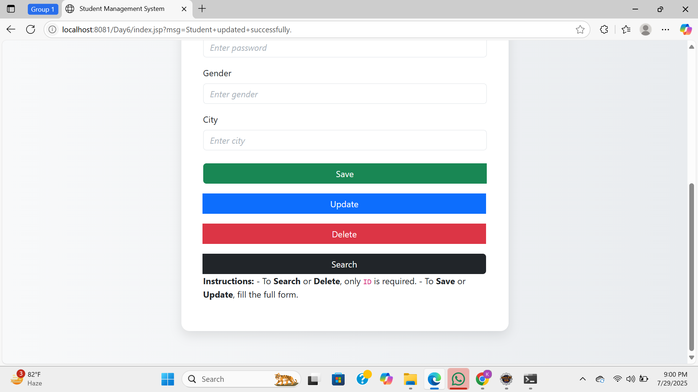
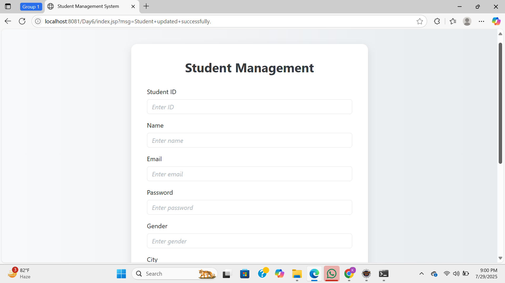

# Student Record Management System

A simple Java EE web application using Servlets, JSP, Hibernate, and MySQL to manage student records.

## ✨ Features

- Add new student records
- View student details
- Update existing student data
- Delete student records
- Search student by ID

## 🛠 Tech Stack

- Java EE (Servlets, JSP)
- Hibernate ORM
- MySQL Database
- Apache Tomcat
- Bootstrap (for UI)

## 📸 Screenshots

